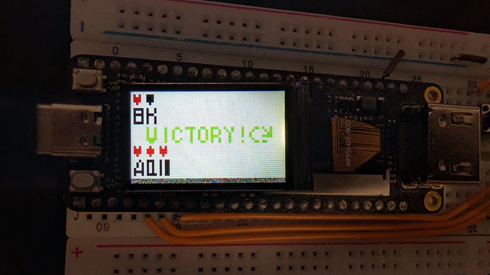
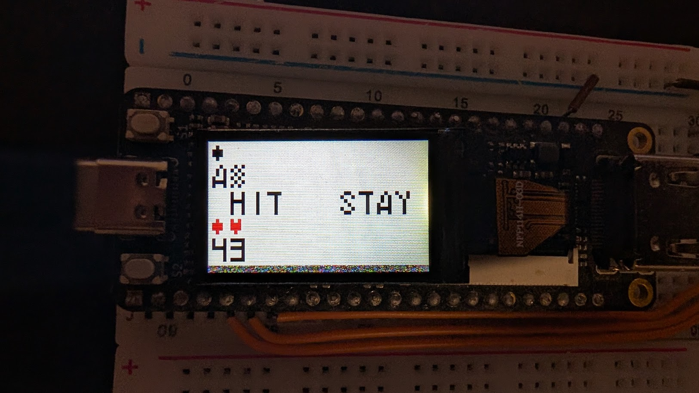
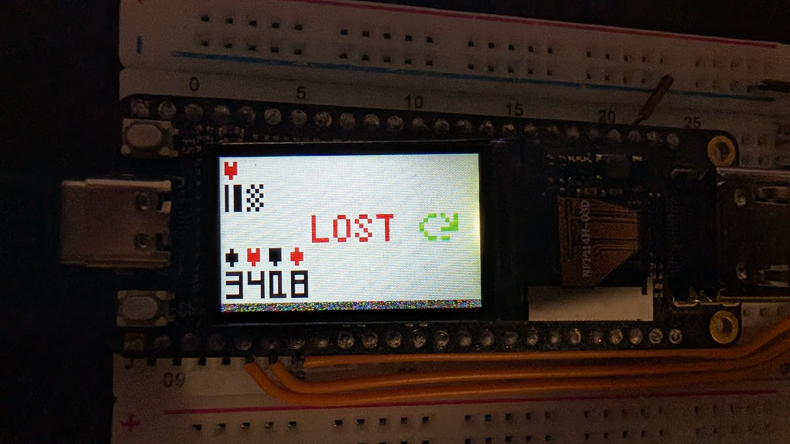
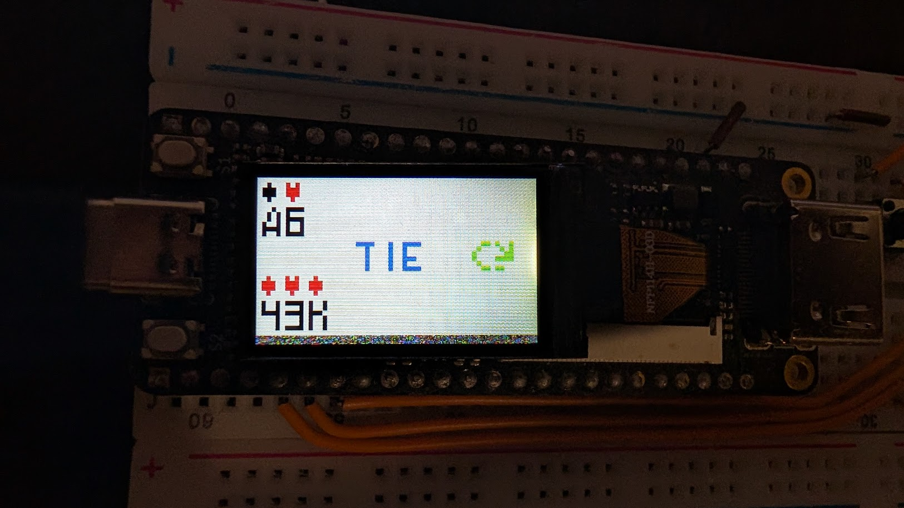

# Blackjack Game — README

A Blackjack game written entirely in assembly, running on the custom 8-bit CPU. It renders a pixel display on a 1.14" SPI LCD, uses three hardware buttons for input, and manages a full card deck with dealing, hand evaluation, and game state logic — all in hand-written assembly.


---

## How to Play

**Button 1** — Hit (take another card)
**Button 2** — Stay (end your turn)
**Button 3** — Not used in gameplay (available for future use)

When the game starts, press any button to deal. Cards appear on screen: dealer's hand at the top, player's hand at the bottom. The dealer's first card is hidden (shown as a filled square).

Standard Blackjack rules: get as close to 21 as possible without going over. Aces count as 11, and automatically drop to 1 if the hand would bust.

---

## Game Structure

The game runs as a state machine in a loop:

```
game_loop:
  read current state from RAM[203]
  dispatch to the matching state handler
  return, repeat
```

Each state handler does its work and writes the next state into `RAM[203]` before returning.

### States

| State ID | Name | What it does |
|---|---|---|
| 0 | `init` | Resets everything, deals opening cards, waits for button press |
| 1 | `player_turn` | Draws HIT / STAY on screen, polls buttons |
| 2 | `hit` | Deals a card to player, checks bust / 21 |
| 3 | `dealer_hit` | Deals cards to dealer using house rules, checks outcomes |
| 4 | `player_win` | Displays WIN, waits for button, resets |
| 5 | `dealer_win` | Displays LOSE, waits for button, resets |
| 6 | `tie` | Displays TIE, waits for button, resets |

---



---



---



---



---

## RAM Layout

The game uses RAM addresses 0–203. Defined in `game/game_memory_mapping.txt`.

```
[0:51]    Cards (52 cards, 1 byte each)
[52:55]   Suits (4 suits, 1 byte each)
[56:59]   draw_symbol input params
[60:164]  Symbol pixel data (35 symbols × 3 bytes each)
[165:172] AND logic masks for pixel rendering
[173:187] Player hand
[188:202] Dealer hand
[203]     Current game state
```

### Card Byte Format

Each card is one byte:
- Bit 7 — taken flag (`1` = already dealt)
- Bits 5–6 — suit (0=heart, 1=spade, 2=diamond, 3=club)
- Bits 0–4 — card value (1–13)

```
bit: 7  6  5  4  3  2  1  0
     T  S1 S0 V4 V3 V2 V1 V0
```

Example: `0b01001010` = not taken, diamond suit (10), value 10 (ten).

### Hand Layout (player at 173, dealer at 188)

Each hand is 15 bytes:
- `[0]` — number of cards currently held
- `[1:12]` — up to 12 card values
- `[13]` — total hand value
- `[14]` — ace counter (number of aces counted as 11)

---

## Init State

```
state_init:
  clean RAM
  clean screen
  init suits and cards in RAM
  init card select symbols
  draw "press button to start" screen
  wait for any button press
  clean screen
  deal 2 cards to player
  deal 1 card to dealer (face down)
  → state = player_turn
```

Card initialisation fills RAM addresses 0–51. Each card is OR'd with its suit bits so the value byte encodes both. The deck is shuffled lazily — `get_random_card` picks a random index and retries if that card is already taken.

---

## Dealing a Card

`deal` is the core subroutine. It takes one argument via the value stack: `0` = deal to player, `1` = deal to dealer.

```asm
LDR R0, 0
PSH R0
CAL @deal     // deal a card to the player
```

Internally it:
1. Calls `get_random_card` — loops until it finds an untaken card, marks it taken, returns the card byte on the stack
2. Appends the card to the hand in RAM
3. Increments the hand length
4. Calls `get_card_value` — extracts the numeric value, handles aces as 11
5. Calls `write_new_value` — adds the card value to the running total, demotes aces from 11→1 if the total exceeds 21
6. Calls `draw_card` — renders the suit symbol and card number on screen

### Ace Handling

When an ace is drawn it counts as 11. The ace counter increments. If the hand total exceeds 21 and there are aces counted as 11, one ace is demoted by subtracting 10 and decrementing the ace counter.

```asm
// simplified logic in write_new_value
total = total + card_value
if total > 21 and ace_counter > 0:
    total -= 10
    ace_counter -= 1
```

---

## Player Turn State

Draws "HIT STAY" on screen and polls the buttons in a tight loop. No interrupts — just busy-wait.

```asm
&wait_for_player_move:
LDR R0, 1
COM R0, RBO1
JZ  @hit        // button 1 pressed → hit
COM R0, RBO2
JZ  @stay       // button 2 pressed → stay
JMP @wait_for_player_move
```

- **Hit** → state = `hit`
- **Stay** → state = `dealer_hit`

---

## Hit State

Deals one card to the player, then checks the total:

```
player total == 21  →  state = dealer_hit  (perfect hand, dealer plays)
player total > 21   →  state = dealer_win  (player busts)
player total < 21   →  state = player_turn (keep playing)
```

---

## Dealer Hit State

The dealer plays by house rules: hit on 16 or less, stand on 17 or more.

```
if dealer total > 21  →  state = player_win
if dealer total ≤ 16  →  state = dealer_hit  (hit again)
if dealer total > player total  →  state = dealer_win
if dealer total < player total  →  state = player_win
if dealer total == player total →  state = tie
```

The dealer's hidden card is revealed (erased and redrawn as a real card) on the first dealer hit.

---

## Drawing on Screen

The display is 60×32 pixels, 4-bit colour. Symbols are stored in RAM as 3-byte bitmaps — each byte holds two rows of 4 pixels (1 bit per pixel), giving a 4×6 pixel character cell.

### draw_symbol

The core rendering routine. Takes four input parameters written to fixed RAM addresses before calling:

| RAM Address | Parameter | Description |
|---|---|---|
| 56 | `param_symbol_key` | Which symbol to draw (index) |
| 57 | `param_x_axis_addr` | X position |
| 58 | `param_y_axis_addr` | Y position |
| 59 | `param_pixel_color_addr` | Colour index |

```asm
WD draw_symbol.v.param_symbol_key,      symbol_heart
WD draw_symbol.v.param_x_axis_addr,     10
WD draw_symbol.v.param_y_axis_addr,     5
WD draw_symbol.v.param_pixel_color_addr, color_red
CAL @draw_symbol
```

AND logic masks (stored at addresses 165–172) control which bits in each bitmap byte correspond to which pixel columns.

### Symbol Index

Symbols are stored starting at RAM address 60 (3 bytes each). The symbol key is the index, not the address — `draw_symbol` computes `address = key * 3 + 57`.

Card numbers (1–13), suit icons (heart, spade, diamond, club), letters (H, I, T, S, A, Y, W, L, E, N), and special symbols (flipped card, blank) are all stored as pixel bitmaps in `game/init/symbols.asm`.

### Colours

Defined in `game/colors.asm` as parameter constants. Four colours used: white, black, red, green.

```asm
$color_white=15
$color_black=0
$color_red=9
$color_green=3
```

---

## Subroutine Calling Convention

Arguments are passed on the value stack using `PSH` before calling. The callee pops them at the start. Return values are pushed onto the stack before `RTN`.

```asm
// call deal with arg = 0 (player)
LDR R0, 0
PSH R0
CAL @deal

// call get_card_value with two args: card, ace_counter_addr
PSH ace_counter_addr_reg
PSH card_reg
CAL @get_card_value
POP result_reg     // return value is on the stack
```

`CAL` saves and restores R0–R7 automatically, so registers are safe across calls. Subroutine-local register aliases are defined with `$` parameters at the top of each file for clarity.

---

## Sleep

`game/sleep.asm` implements a 1-second delay using the hardware timer:

```asm
CAL @sleep    // pause for 1000ms
```

Internally: loads 1000 (0x03E8) into RTM0/RTM1, starts the timer, then busy-waits on `RTMD`.

---

## File Structure

```
game/
  game.asm              Main loop and state dispatch
  game_memory_mapping.txt RAM layout documentation
  colors.asm            Colour constants
  clean_text.asm        Clears the middle text row on screen
  deal.asm              Card dealing, value calculation, rendering
  draw_again.asm        "Play again" screen
  draw_symbol.asm       Core pixel renderer
  screen.asm            Full screen clear
  sleep.asm             1-second timer delay
  wait_for_button_click.asm  Waits for any button press
  init/
    clean_ram.asm       Zeros out all game RAM
    cards.asm           Initialises the 52-card deck
    suits.asm           Initialises the 4 suit values
    random.asm          Seeds the LFSR random generator
    symbols.asm         Writes all pixel bitmaps to RAM
  states/
    state.asm           State constants and state_addr param
    init.asm            Init state handler
    player_turn.asm     Player turn state handler
    hit.asm             Hit state handler
    dealer_hit.asm      Dealer hit state handler
    player_win.asm      Player win state handler
    dealer_win.asm      Dealer win state handler
    tie.asm             Tie state handler
```